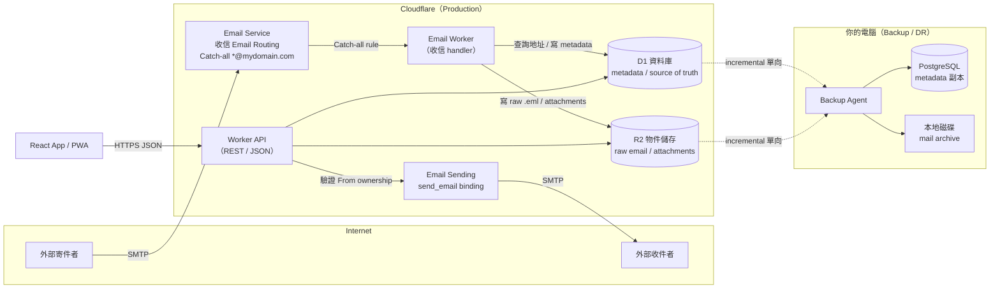
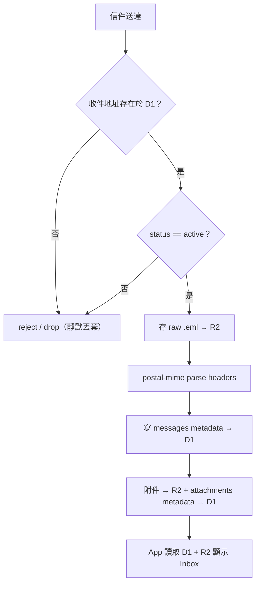

# 01 — 最終架構與 Production Data Flow

> 本文是 `mail_PRD_SRS.md` 的第一階段設計輸出。
> 文件中 `mydomain.com` 為佔位 domain，實作時替換為真實 domain。
> 原則：**全部站在 Cloudflare 現有服務之上，不自建任何 Mail 基礎設施（MX / SMTP / MIME server）。**

## 1. 元件總表

| 元件 | 角色 | 誰提供 | 狀態 |
|---|---|---|---|
| Domain + DNS（MX / SPF / DKIM / MTA-STS / bounce MX） | 收發信的 DNS 基礎 | Cloudflare（Email Routing / Sending 啟用時自動建立 MX、SPF、DKIM、bounce MX；**MTA-STS 的 `_mta-sts` CNAME 需手動**，見 07 Step 6） | Cloudflare 現成 |
| Email Routing（收信） | 接受 Internet 信件 → 依 routing rule 轉給 Worker | Cloudflare Email Service | Cloudflare 現成 |
| Email Worker（收信 handler） | Catch-all 接收 → 查 D1 決定 accept/reject → raw 存 R2 → metadata 存 D1 | 我們開發（Workers + TypeScript） | 我們寫 |
| Worker API（REST） | App 後端：地址 CRUD、Inbox、附件、寄信、alias、backup 讀取 | 我們開發（Workers + TypeScript） | 我們寫 |
| Email Sending（`send_email` binding） | 寄信到 Internet | Cloudflare Email Service（Workers Paid） | Cloudflare 現成 |
| D1 | Production metadata / index / source of truth | Cloudflare D1 | Cloudflare 現成 |
| R2 | raw .eml / attachment / 大型物件 | Cloudflare R2 | Cloudflare 現成 |
| React App / PWA | 使用者介面（瀏覽器） | 我們開發 | 我們寫 |
| Backup Agent | 定時把 D1 + R2 單向同步到本地 | 我們開發（本機執行） | 我們寫 |
| PostgreSQL + 本地磁碟 | Backup / DR 唯讀副本 | 使用者自備 | 我們管理 |

## 2. 整體架構圖

## 3. 職責邊界（誰對什麼負責）

| 資料 | 權威來源（authoritative） | 副本 |
|---|---|---|
| users / email_addresses / aliases / messages / attachments metadata | **D1** | PostgreSQL（備份） |
| raw .eml、attachment 內容 | **R2** | 本地磁碟（備份） |
| 收信規則（catch-all） | Cloudflare Email Routing | — |
| 寄信佇列與送達 | Cloudflare Email Service | send_status 記錄於 D1 |

**鐵則（沿用 PRD）：**
1. D1 與 PostgreSQL **不做雙向同步**——只有 D1 → PostgreSQL 單向。
2. 本地 PostgreSQL / 磁碟 / 電腦關機或斷網，**絕不影響 Cloudflare Production 收發信**。
3. Cloudflare 只有**一條** routing rule（catch-all）；虛擬地址增刪改一律寫 D1，不碰 Cloudflare API。

## 4. Production Data Flow（彙總）

## 5. 需要記住的平台事實（2026-09 查證）

- 收信（Email Routing）：Workers Free / Paid 皆可用、**免費、無限**。
- 寄信（Email Sending）：**僅 Workers Paid**；$5/月含 3,000 封，超出 $0.35/千封；單封 ≤ 5 MiB。
- Email Routing 每 domain 上限 200 條 rule → 印證「一條地址一條 rule」不可行，catch-all 是唯一解。
- 啟用 routing 前須先驗證至少一個真實 destination 信箱（手動步驟，見 07 文件）。
- 寄出前 domain 須完成 sending onboarding（SPF/DKIM/bounce MX 由 Cloudflare 自動建立於 `cf-bounce` 子網域；**MTA-STS 訊號需手動建立**，見 `07-cloudflare-resources.md` Step 6）。
