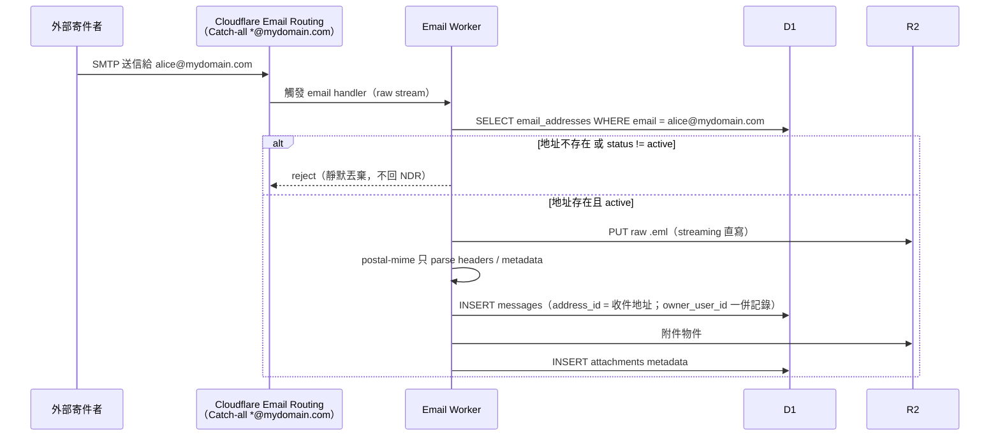
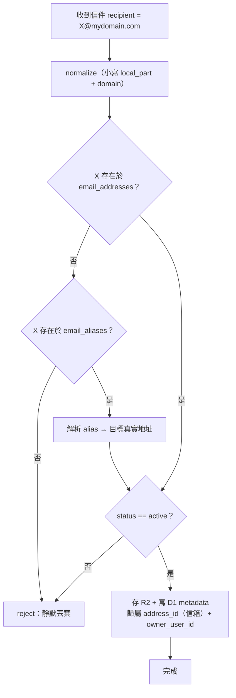
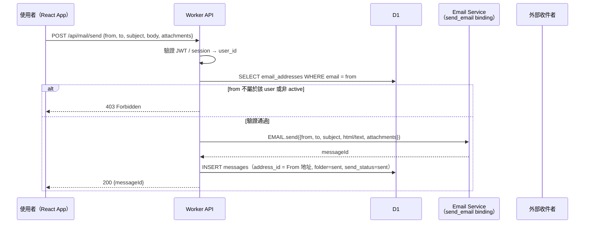
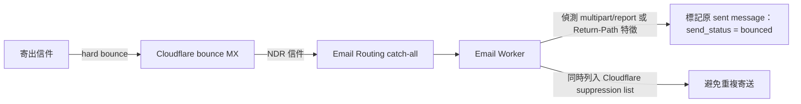

# 02 — Email Flows（收信 / 寄信 / 例外路徑）

> 對應 PRD §三（收信）與 §九（寄信），含 2026-09 查證後的平台限制。
> `mydomain.com` 為佔位 domain。

## 1. Incoming Email Flow（收信）

### 1.1 Worker 收信決策邏輯

**設計決策：**
- **Alias 只允許一層**：alias 的 target 只能是 `email_addresses` 中的真實地址（不可指向另一個 alias）→ **alias loop 在結構上不可能發生**，不需要 runtime 迴圈偵測。
- **Reject = 靜默丟棄**：catch-all 收到不存在的地址時不回 NDR（避免被當 bounce 放大器 / 揭露有效地址）。
- **解析順序**：真實地址優先 → 其次 alias（alias 名稱與真實地址衝突時，真實地址勝出）。

## 2. Outgoing Email Flow（寄信）

### 2.1 寄信前置條件（平台限制）

| 條件 | 值 | 說明 |
|---|---|---|
| Plan | **Workers Paid** | Free plan 只能寄給 verified destination addresses |
| Sending onboarding | 完成 | Cloudflare 自動建 SPF/DKIM/bounce MX records（於 `cf-bounce` 子網域）+ DMARC；**MTA-STS 需手動**（`_mta-sts` CNAME + policy Worker，見 07 Step 6） |
| 單封大小 | ≤ 5 MiB（含附件） | 超過收 `552 5.3.4 Message too big` |
| 收件人數 | ≤ 50（to+cc+bcc） | — |
| 每日配額 | 動態 | 新帳號保守、隨信譽自動調升；大量寄送需申請 |

**From spoof 防護（PRD 要求）：** 每個寄信請求都必須在 D1 驗證 `from` 屬於呼叫者 user 且 status=active，否則 403。任何人不能以 `admin@` / `ceo@` 等不屬於自己的地址寄出。

## 3. Bounce / NDR 路徑（收信端）

寄出的信 hard bounce 時，Cloudflare 經由 bounce MX 接收退信；因 catch-all，**退信（NDR）會以一般信件回到寄件者的虛擬地址 inbox**。

**注意：** 應用層不得把 NDR 再轉寄（防 NDR loop）；Cloudflare 已限制 References > 100 時 `message.reply()` 會 throw，作為平台層保險。

## 4. 例外與邊界清單

| 情境 | 行為 |
|---|---|
| 收件地址不存在 / disabled / deleted | 靜默丟棄 |
| Alias 目標不存在或 disabled | 視同不存在 → 丟棄 |
| 超過 25 MiB 入站信件 | Cloudflare 直接 reject（不收） |
| 超過 5 MiB 寄出 | API 回 4xx（`552` / 應用層先行檢查） |
| 寄件者偽造 From | 403 Forbidden |
| Worker 處理失敗（CPU / 例外） | Workers logs 可查；信件以原始形式留存 R2（若已寫入），可設計重試佇列（MVP 可先手動補處理） |
| 本地備份機器關機 | 不影響 Production（單向備份設計） |

## 5. 給 React App 的關鍵 API 對應（細節見 05 文件）

- 收信顯示：`GET /api/mail/inbox`、`GET /api/mail/:id`、`GET /api/attachments/:id`
- 寄信：`POST /api/mail/send`
- 地址管理：`POST/GET/PATCH/DELETE /api/email-addresses*`
