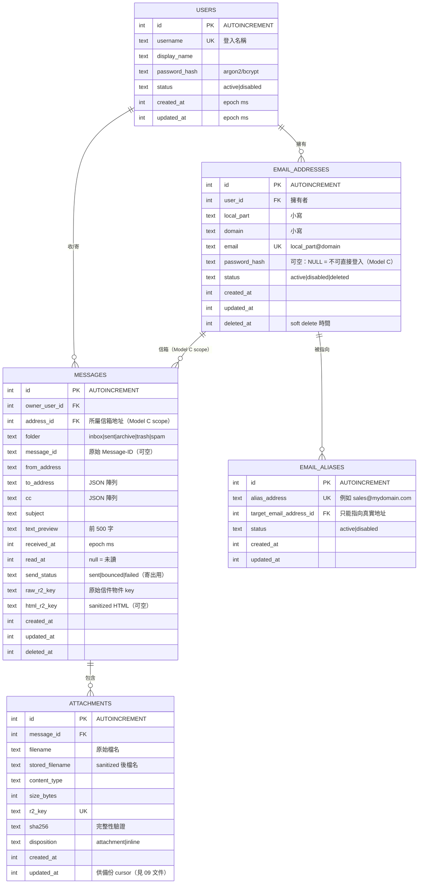

# 03 — Database Schema（ER Diagram + D1 Tables）

> 對應 PRD §四～§八。所有時間欄位統一 **INTEGER（Unix epoch 毫秒, UTC）**：
> 排序、範圍查詢、備份 cursor 都簡單且無時區 bug。
> 所有 enum 用 TEXT + CHECK 約束。刪除一律 **soft delete**（`deleted_at`）。

## 1. ER Diagram



## 2. 建表 SQL（D1 migrations 用）

```sql
CREATE TABLE users (
  id            INTEGER PRIMARY KEY AUTOINCREMENT,
  username      TEXT NOT NULL UNIQUE,
  display_name  TEXT,
  password_hash TEXT NOT NULL,
  status        TEXT NOT NULL DEFAULT 'active'
                CHECK (status IN ('active','disabled')),
  created_at    INTEGER NOT NULL,
  updated_at    INTEGER NOT NULL
);

CREATE TABLE email_addresses (
  id         INTEGER PRIMARY KEY AUTOINCREMENT,
  user_id    INTEGER NOT NULL REFERENCES users(id),
  local_part TEXT NOT NULL,
  domain     TEXT NOT NULL,
  email      TEXT NOT NULL UNIQUE,
  password_hash TEXT,          -- NULL = 不能直接登入；有值 = 信箱帳號（Model C）
  status     TEXT NOT NULL DEFAULT 'active'
             CHECK (status IN ('active','disabled','deleted')),
  created_at INTEGER NOT NULL,
  updated_at INTEGER NOT NULL,
  deleted_at INTEGER,
  UNIQUE (local_part, domain)
);
CREATE INDEX idx_addr_user ON email_addresses(user_id) WHERE deleted_at IS NULL;

CREATE TABLE email_aliases (
  id                       INTEGER PRIMARY KEY AUTOINCREMENT,
  alias_address            TEXT NOT NULL UNIQUE,
  target_email_address_id  INTEGER NOT NULL REFERENCES email_addresses(id),
  status                   TEXT NOT NULL DEFAULT 'active'
                           CHECK (status IN ('active','disabled')),
  created_at               INTEGER NOT NULL,
  updated_at               INTEGER NOT NULL
);
CREATE INDEX idx_alias_target ON email_aliases(target_email_address_id);

CREATE TABLE messages (
  id            INTEGER PRIMARY KEY AUTOINCREMENT,
  owner_user_id INTEGER NOT NULL REFERENCES users(id),
  address_id    INTEGER NOT NULL REFERENCES email_addresses(id),  -- 收信=收件地址；寄信=From 地址
  folder        TEXT NOT NULL DEFAULT 'inbox'
                CHECK (folder IN ('inbox','sent','archive','trash','spam')),
  message_id    TEXT,
  from_address  TEXT NOT NULL,
  to_address    TEXT NOT NULL DEFAULT '[]',   -- JSON 陣列
  cc            TEXT NOT NULL DEFAULT '[]',   -- JSON 陣列
  subject       TEXT,
  text_preview  TEXT,
  received_at   INTEGER NOT NULL,
  read_at       INTEGER,
  send_status   TEXT CHECK (send_status IN ('sent','bounced','failed')),
  raw_r2_key    TEXT NOT NULL,
  html_r2_key   TEXT,
  created_at    INTEGER NOT NULL,
  updated_at    INTEGER NOT NULL,
  deleted_at    INTEGER
);
CREATE INDEX idx_msg_owner_folder_time
  ON messages(owner_user_id, folder, received_at DESC);
CREATE INDEX idx_msg_address_folder_time
  ON messages(address_id, folder, received_at DESC);
CREATE INDEX idx_msg_updated ON messages(updated_at) WHERE deleted_at IS NULL;

CREATE TABLE attachments (
  id              INTEGER PRIMARY KEY AUTOINCREMENT,
  message_id      INTEGER NOT NULL REFERENCES messages(id),
  filename        TEXT NOT NULL,          -- 原始（供顯示）
  stored_filename TEXT NOT NULL,          -- sanitized（供 R2 key）
  content_type    TEXT,
  size_bytes      INTEGER NOT NULL,
  r2_key          TEXT NOT NULL UNIQUE,
  sha256          TEXT,
  disposition     TEXT NOT NULL DEFAULT 'attachment'
                  CHECK (disposition IN ('attachment','inline')),
  created_at      INTEGER NOT NULL,
  updated_at      INTEGER NOT NULL
);
CREATE INDEX idx_att_msg ON attachments(message_id);
```

## 3. 設計決策與理由

| 決策 | 理由 |
|---|---|
| `email` 直接存完整字串 + UNIQUE | Worker 收信查詢只需一次等值 lookup（`WHERE email = ?`），配合 index 極快；不需要拆欄比對 |
| 同時保留 `(local_part, domain)` UNIQUE | 資料完整性雙保險 |
| Alias target 只能指向 `email_addresses` | **結構上排除 alias chain → loop 不可能**（PRD §五要求） |
| `messages.to_address / cc` 用 JSON 文字 | MVP 不需正規化多對多收件人；寄信時可用於回顯 |
| `folder` 涵蓋 inbox/sent/archive/trash/spam | PRD §七要求；`trash` + `deleted_at` 實作 soft delete |
| `send_status` 只對寄出信件使用 | bounce（NDR）回來時由收信 Worker 更新對應 sent message（見 02 文件） |
| `updated_at` + `deleted_at` 全部存在 | 供備份 Agent 做 incremental cursor（見 09 文件） |
| `email_addresses.password_hash`（可空） | Model C：有密碼的地址 = 可獨立登入的信箱帳號；NULL = 只能由 owner 管理 |
| `messages.address_id`（信件所屬信箱） | Model C scope 主鍵：信箱帳號登入只看得到該 address 的信；`owner_user_id` 保留供 owner 聚合與備份 |
| 時間用 epoch ms INTEGER | 排序正確、SQLite 友好、備份比對簡單 |

## 4. 未來擴充預留（MVP 不實作）

- `messages` 可加 `conversation_id` / threading（之後再評估）
- Spam 評分欄位（若需要自建過濾）
- 若未來需要「一封寄給多個自己地址的信同時出現在多個 inbox」→ 拆 `message_recipients` 表（現階段每封信歸屬單一 owner）
