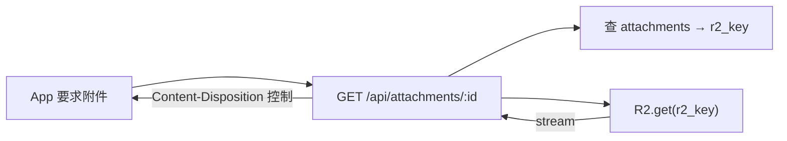

# 04 — R2 Object Key 設計

> 對應 PRD §八、§十四。R2 只放「內容」，所有索引在 D1（見 03 文件）。
> Key 設計目標：**可預測、可列舉、防路徑穿越、支援增量備份**。

## 1. Key 命名規則總表

| 類型 | Key 格式 | 範例 |
|---|---|---|
| Raw email（原始 .eml） | `mail/{YYYY}/{MM}/{message_id}.eml` | `mail/2026/09/01JQ3X...A.eml` |
| HTML body（sanitized） | `mail/{YYYY}/{MM}/{message_id}.html` | `mail/2026/09/01JQ3X...A.html` |
| Attachment | `attachments/{message_id}/{stored_filename}` | `attachments/01JQ3X...A/invoice-2026.pdf` |

- `{message_id}` = **每封信一個 UUID**（實作採 `crypto.randomUUID()`，與 `.eml`/`.html` 同一個 UUID）。**不採用** D1 的 INTEGER id 當 key（可列舉、易被猜測）；D1 與 R2 的對應關係存在 `messages.raw_r2_key` / `messages.html_r2_key` / `attachments.r2_key`。
- `{YYYY}/{MM}` 取信件 `received_at` 的 UTC 年月 → 目錄分區，備份 Agent 可只列舉某月份。

## 2. Attachment 檔名 sanitization

原始檔名（`filename`）**不可直接當 key**（可能含 `../`、`\`、空字元、過長、控制字元）。

```text
stored_filename = 時間前綴 + "_" + sanitized 檔名
  1. 只保留 basename（去路徑）
  2. 移除控制字元與保留字元（\ / : * ? " < > | 與不可見字元）
  3. 全部換成底線以外的安全字集，中文保留（UTF-8 合法）
  4. 限制長度 ≤ 150 chars，過長截斷並保留副檔名
  5. 副檔名白名單以外的統一加 .bin？→ 否：保留原副檔名僅供顯示，
     下載時以 Content-Type + Content-Disposition 控制（見 05 文件）
  6. 加上 message_id 前置避免不同信件同名衝突
```

範例：

```text
原始：../../etc/passwd            → 99f3_invoice.pdf 不可能（無副檔名白名單轉寫），
                                  實際：直接拒絕或轉成 <id>_unknown.bin
原始：報價單(最終版).PDF          → 01JQ3X...A_報價單_最終版_.pdf
原始：report v1.2 FINAL.xlsx      → 01JQ3X...A_report-v1.2-FINAL.xlsx
```

**規則重點：** D1 同時存 `filename`（原始，僅顯示用）與 `stored_filename`（實際 key 用），兩者分離。

## 3. Metadata 與完整性

每個 R2 object 建議用 **R2 custom metadata** 記錄：

| metadata key | 內容 |
|---|---|
| `sha256` | 內容雜湊（上傳時計算）→ 備份驗證用 |
| `content-type` | 正確 MIME |
| `d1-message-id` / `d1-attachment-id` | 對應 D1 主鍵（反向追蹤） |
| `uploaded-at` | epoch ms |

D1 的 `attachments.sha256` 與 R2 metadata `sha256` 一致 → 備份/還原可驗證完整性（PRD §十四 checksum 要求）。

## 4. 讀取路徑設計（給 API / App）



- 下載檔名用 D1 的**原始 filename** 放 `Content-Disposition`（經 RFC 5987 編碼），**不洩漏 stored_filename**。
- 一律透過 Worker API 代理下載（**不開放 R2 public bucket**）→ 才能做權限檢查 + rate limit + audit。

## 5. 目錄分區對備份的意義

```text
R2:
  mail/2026/09/*.eml        ← Backup Agent 只抓「還沒備份的月份/物件」
  mail/2026/10/*.eml
  attachments/...
```

本地鏡像結構（見 09 文件）與 R2 **完全同構**：

```text
C:\mail-backup\
  2026\09\{message_id}.eml
  attachments\{message_id}\{stored_filename}
```

同構的好處：restore 時 key 一一對應，不需要對照表（除了 D1 metadata 裡的路徑欄位）。

## 6. 不這樣設計的理由（避免踩雷）

| 方案 | 為什麼不用 |
|---|---|
| 用外部 Message-ID 當 key | 不可信、可重複、含 `<>`/空格等不合法 key 字元 |
| 附件 key 用原始檔名 | path traversal、撞名、特殊字元問題 |
| R2 public bucket + 直接 URL | 無法做權限/稽核；附件應只有 owner 可取 |
| 全部塞 `mail/` 不分區 | 備份列舉與生命週期管理困難 |
