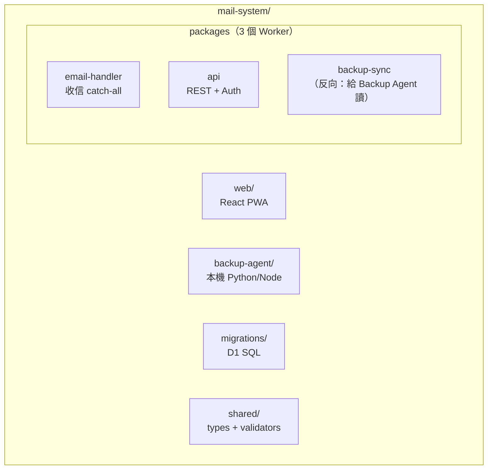

# 06 — Project Folder Structure（Wrangler / TypeScript）

> 對應 PRD §十九 Phase 1。單一 monorepo，**pnpm workspaces**（Phase 2 決定，2026-09-03：`pnpm-workspace.yaml` + `pnpm-lock.yaml`）。
> **2026-09-13 補註：** 測試環境用 `@cloudflare/vitest-plugin`（`vitest.config.mts` + `test/wrangler.jsonc`，測試於 workerd 內執行）；測試檔放各套件 `test/*.spec.ts`；根目錄 `pnpm test`。

## 1. 總覽



**為什麼拆 3 個 Worker（而不是 1 個）：**
- `email-handler` 由 Email Routing 觸發（事件型，無 HTTP）；`api` 是 HTTP 服務。兩者生命週期與失敗模式不同。
- `backup` endpoint 也可以放 `api` 內，但給它獨立 route + 獨立 token 驗證較乾淨 → MVP 合併進 `api`，標 `BACKUP_TOKEN`（見 05 §2.6）。**決策：MVP 只有 2 個 Worker。**

## 2. 目錄結構（完整）

> ⚠️ **2026-10-06 實況補註**：以下為 Phase 1 的**規劃**結構，實作時做了簡化 —— 以實況為準：
> - `packages/api` **未拆** `routes/`、`services/`、`middleware/`；實際是 `src/index.ts`（Hono 路由全部在此）＋ `src/auth.ts`（Model C 認證）＋ `src/backup.ts`（備份游標工具）＋ `src/index.test` 系列的 `test/`
> - `packages/backup-agent` 是 **Node/TypeScript**（非 Python），入口 `src/index.ts`
> - `web/`（React PWA）**不在本 repo**：改由**外部自建 App** 透過 API 收發信 → 見 `12-pwa-integration.md`
> - 新增 `scripts/`：`register-backup-tasks.ps1`（註冊 Windows 排程）、`backup-agent.cmd`（監督迴圈 wrapper）、`backup-verify.cmd`、`backup-watchdog.cmd`、`backup_watchdog.py`（每 10 分鐘健檢＋郵件告警＋雲端心跳）、`run-hidden.vbs`（**隱藏視窗啟動器**：排程動作經 `wscript.exe` 以視窗狀態 0 執行，否則每 10 分鐘會在桌面彈出 cmd 視窗）
> - 新增第 4 個 Worker `packages/heartbeat`（`atwhomail-heartbeat`，2026-10-06）：D1 `system_heartbeat` ＋ Cron 每 15 分鐘，補上「整台機器關機」的告警盲區（`11` §2-5、§5 #13）

```text
mail-system/
├── package.json                    # workspaces root
├── wrangler.jsonc                  # root 共用設定（compatibility_date 等）
├── .dev.vars                       # 本機 secrets（gitignore）
├── migrations/
│   └── 0001_init.sql               # 03 文件的 DDL（每份 migration 一個檔）
├── packages/
│   ├── shared/                     # 兩端共用（純函式，無 runtime dep）
│   │   ├── src/
│   │   │   ├── types.ts            # User/EmailAddress/Message/Attachment 型別
│   │   │   ├── validate.ts         # zod schemas（local_part 規則、payload 驗證）
│   │   │   ├── sanitize.ts         # HTML sanitize、檔名 sanitize、email normalize
│   │   │   └── ids.ts              # key 產生、cursor 編碼
│   │   └── package.json
│   ├── email-handler/              # Worker ①：收信
│   │   ├── wrangler.jsonc          # D1 + R2 bindings；觸發：email routing
│   │   ├── src/
│   │   │   ├── index.ts            # export default { email(message, env, ctx) }
│   │   │   ├── routing.ts          # 查地址→alias→決策（02 文件 §1.1）
│   │   │   ├── store.ts            # stream raw → R2；寫 D1 metadata
│   │   │   ├── mime.ts             # postal-mime 包裝（只 parse metadata）
│   │   │   └── ndr.ts              # 辨識退信（multipart/report）→ 更新 send_status
│   │   └── test/
│   └── api/                        # Worker ②：REST + Auth + 寄信
│       ├── wrangler.jsonc          # D1 + R2 + send_email bindings
│       ├── src/
│       │   ├── index.ts            # Router（Hono）掛載
│       │   ├── auth.ts             # JWT 驗證 / session（Phase 11）
│       │   ├── routes/
│       │   │   ├── addresses.ts    # /api/email-addresses*
│       │   │   ├── aliases.ts      # /api/email-aliases*
│       │   │   ├── inbox.ts        # /api/mail/inbox、folder、read
│       │   │   ├── mail.ts         # /api/mail/:id 詳情
│       │   │   ├── attachments.ts  # 清單 + 下載 stream
│       │   │   ├── send.ts         # POST /api/mail/send（ownership 驗證）
│       │   │   └── backup.ts       # GET /api/backup/changes（BACKUP_TOKEN）
│       │   ├── services/
│       │   │   ├── d1.ts           # SQL 集中在這（參數化查詢）
│       │   │   ├── r2.ts           # get/put + sha256
│       │   │   └── sender.ts       # EMAIL.send 包裝（5 MiB 前檢查）
│       │   └── middleware/
│       │       ├── auth.ts         # Bearer JWT → user_id
│       │       ├── ownership.ts    # 資源屬於自己才放行
│       │       └── ratelimit.ts    # 每 user 寄信/分鐘 限制
│       └── test/
├── web/                            # React PWA（之後 Phase 17+）
│   └── (後補)
├── backup-agent/                   # 本機備份程式（Phase 12-14）
│   ├── pyproject.toml              # 或 package.json（擇一，Phase 12 決定）
│   ├── agent.py                    # 主迴圈：每 N 分鐘拉 /api/backup/changes
│   ├── pg.py                       # PostgreSQL upsert
│   ├── r2sync.py                   # 列舉 R2 → 下載未備份 → 本地磁碟 + checksum
│   └── config.yaml                 # token、endpoint、路徑
└── docs/                           # 本文件群 + PRD
```

## 3. 每個目錄的用途（速查）

| 路徑 | 用途 | 由哪個 Phase 建立 |
|---|---|---|
| `migrations/` | D1 schema 版本化（`wrangler d1 migrations apply`） | Phase 3 |
| `packages/shared` | 型別 + 驗證 + sanitize 共用，避免兩 Worker 邏輯漂移 | Phase 3 |
| `packages/email-handler` | 收信：catch-all 觸發、決策、存 R2/D1 | Phase 5–6 |
| `packages/api` | 全部 HTTP API + auth + 寄信 | Phase 7–11 |
| `backup-agent/` | 本機單向備份 | Phase 12–14 |
| `web/` | React PWA 前端 | Phase 17+ |

## 4. Bindings 對照（wrangler.jsonc 摘要）

```jsonc
// packages/email-handler/wrangler.jsonc
{
  "d1_databases": [{ "binding": "DB", "database_name": "mail-d1" }],
  "r2_buckets":   [{ "binding": "MAIL", "bucket_name": "mail-r2" }]
}

// packages/api/wrangler.jsonc
{
  "d1_databases": [{ "binding": "DB", "database_name": "mail-d1" }],
  "r2_buckets":   [{ "binding": "MAIL", "bucket_name": "mail-r2" }],
  "send_email":   [{ "name": "EMAIL" }]
}
```

## 5. 開發工具鏈（建議）

| 工具 | 用途 |
|---|---|
| Wrangler | 部署 / `wrangler dev` 本機開發 |
| Hono | API router（輕量、Workers 原生） |
| Drizzle ORM（選用） | migrations + typed queries；或純 SQL（本文件先以純 SQL 為準，Phase 3 決定） |
| postal-mime | 收信 MIME metadata parse（streaming 友好） |
| zod | payload 驗證（shared/validate.ts） |
| Vitest | Worker 測試 |
