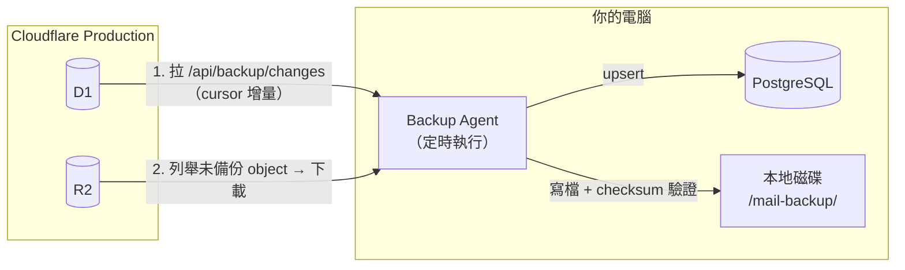
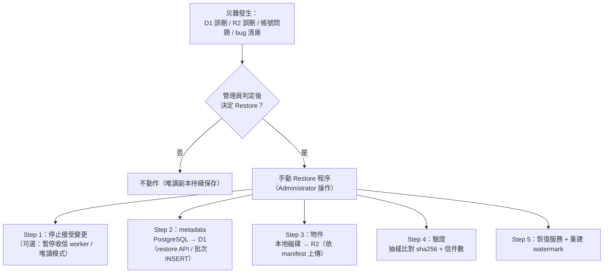

# 09 — Backup / Disaster Recovery 設計

> 對應 PRD §十二～§十五。鐵則：**單向、增量、不影響 Production**。
> Cloudflare（D1+R2）= Source of Truth；本機 PostgreSQL + 磁碟 = Backup/DR 唯讀副本。

## 1. Backup 架構圖



## 2. D1 → PostgreSQL（metadata 增量）

### 2.1 Cursor 設計

各表都有 `updated_at`（epoch ms）。Agent 每次同步帶上次的 watermark：

```text
GET /api/backup/changes?cursor=<watermark>&limit=1000
```

Worker 端邏輯（`routes/backup.ts`）：

```sql
-- 每個需要備份的表各查一次，合併回傳：
SELECT * FROM messages
 WHERE updated_at > :cursor
   AND deleted_at IS NULL
 ORDER BY updated_at ASC LIMIT :limit;   -- created

SELECT * FROM messages
 WHERE deleted_at IS NOT NULL
   AND updated_at > :cursor
 ORDER BY updated_at ASC LIMIT :limit;   -- deleted
```

```json
{
  "nextCursor": 1788123456789,
  "created":  [{ "table": "messages", "row": { ... } }],
  "updated":  [...],
  "deleted":  [{ "table": "messages", "row": { ... } }]
}
```

**實作註記（2026-09-15，Phase 13 完成）：** 改採**每表各自 keyset 游標**，理由：五張表資料量不同，單一全域游標會被最慢的表拖住（或需跨表取最小值，邏輯脆弱），而本機 `backup_watermark(table_name, cursor, cursor_id)` 本來就是每表一列。
- 請求：`GET /api/backup/changes?limit=500&c_users=<updated_at>_<id>&c_messages=...`
- 回應：`{ limit, tables: { <table>: { cursor, more, rows } }, created[], updated[], deleted[], hasMore }`
- 分類：`deleted`（`deleted_at` 非 NULL）／`created`（`created_at` 晚於游標）／`updated`（其餘）；Agent 對 created/updated 一視同仁 upsert。
- 冪等：`ON CONFLICT (id) DO UPDATE … WHERE <table>.updated_at <= EXCLUDED.updated_at`（舊資料不會蓋掉新資料）。

**同步週期建議**：metadata 每 5–15 分鐘；R2 每小時（或信件量少時每天一次）。

### 2.2 一致性注意

- `users` / `email_addresses` / `email_aliases` / `attachments` 用同一套 `updated_at` cursor。
- attachments 的 `updated_at`？03 表沒有該欄 → **備份以 message 為錨點**：attachments 跟隨其 message 一起拉（`WHERE message_id IN (...)`），或 03 表補 `updated_at`。**決策：03 的 attachments 增加 `updated_at` 欄（備份需要）→ 回寫 03 文件。**
- 支援多頁：`limit` + 以 `(updated_at, id)` 做次頁 cursor，避免同毫秒漏列。
- 還原或重跑不怕：PostgreSQL 端 **upsert（ON CONFLICT (id) DO UPDATE）**，且以 `updated_at` 較新者覆蓋。

### 2.3 替代方案（待 Phase 13 驗證）

Cloudflare D1 若已提供 **`changes()` 變更資料擷取 API**，可取代自製 cursor（平台保證不漏）。MVP 先用 §2.1 方案（只依賴 `updated_at`，任何 SQLite 都成立），Phase 13 時實測 `changes()` 後決定是否切換。

## 3. R2 → 本地磁碟（物件增量）

```text
本地鏡像與 R2 同構（見 04 文件）：

/mail-backup/
├── 2026/09/{message_id}.eml
├── 2026/10/{message_id}.eml
└── attachments/{message_id}/{stored_filename}
```

Agent 邏輯：

1. `R2.list(prefix="mail/")` → 拿全部 object key + `uploaded-at`。
2. 與本地比對（本地可存一份 `manifest.json`：key → sha256 + size + backup_time）。
3. **只下載**：本地沒有、或 sha256/size 不符的 object。
4. 下載後算 sha256 → 與 R2 custom metadata `sha256` 比對 → 不符即重抓並告警（checksum 驗證，PRD §十四）。
5. 更新 manifest。

**實作註記（2026-09-15，Phase 14 完成）：**
- 列舉／下載走 **api Worker 端點**（`GET /api/backup/r2/objects?prefix=&limit=&after=`、`GET /api/backup/r2/object?key=`），認證用 rescue token；不需要給 Agent 額外的 R2 憑證。
- 金鑰白名單：`^(mail|attachments)/`（擋 path traversal）；prefix 亦限 `mail/` 或 `attachments/`。
- **本地路徑**：`mail/` 前綴在本地省略（→ `<BACKUP_ROOT>/2026/09/<uuid>.eml`），`attachments/…` 原樣保留；`r2_manifest` 記 `local_path` 供還原使用。
- **保守刪除策略（刻意設計）**：R2 端物件消失時，**本地檔案不刪**——備份工具必須能救回「誤刪 R2」的情境；`r2_manifest` 亦保留該列。
- **sha256 來源**：R2 custom metadata 有 `sha256` 時強制比對（不符重抓一次）；`mail/` 物件目前沒有該 metadata，改由 `r2_manifest` 記錄下載時計算的 sha256，並以 `pnpm verify`（`src/verify-r2.ts`）重算比對（可抓同尺寸損毀，缺檔/損毀 → exit 1，可接排程告警）。
- 週期：`R2_SYNC_INTERVAL_MS`（預設 1 小時；0 = 每 tick）。

## 4. PostgreSQL Schema（備份端，非 Production）

**實作（2026-09-15）：** 已落地為 `packages/backup-agent/migrations/0001_local.sql`（Agent 啟動時自動套用，記錄於 `local_migrations`）。時間欄位用 **BIGINT**（PG INTEGER 為 32-bit，epoch ms 會溢位）；鏡像表不設 FK（分批到達時不強制順序）。

```sql
-- 與 D1 表同構（id 相同），只多備份用欄位：
--   backup_synced_at（本機寫入時間）
--   is_deleted（D1 soft delete 的鏡像）

users            (id PK, ..., backup_synced_at, is_deleted)
email_addresses  (同構)
email_aliases    (同構)
messages         (同構)
attachments      (同構)

backup_watermark (table TEXT PK, cursor INTEGER)   -- 每表進度
r2_manifest      (r2_key TEXT PK, sha256, size, local_path, backup_time)
```

## 5. Disaster Recovery（手動 Restore）



**Restore 原則（PRD §十五）：**
- **永不自動執行**——只有管理者主動跑。
- Restore 前先完整備份當前（壞的）狀態，避免覆蓋掉可挽救資料。
- Restore 寫入 D1/R2 的 API 需要**管理員 token**（比 BACKUP_TOKEN 更高權限），且寫入時保留原始 `id` / `created_at`，避免破壞 FK 與 cursor 語意。
- 還原後重設本地 `backup_watermark`（避免舊 cursor 跳過剛寫入的資料）。

### 5.1 Runbook（實作：2026-09-15，離線腳本／攻擊面 0）

**設計決策**：restore 走「離線腳本 + 既有 CF token」，**不在 production Worker 新增任何可寫入端點**（Phase 15 選項 B）。腳本位於 `packages/backup-agent/src/restore-*.ts`。

| 步驟 | 指令 | 說明 |
|---|---|---|
| 0 | `pnpm --filter @atwhomail/backup-agent run verify` | 先確認本機鏡像完整（缺檔/損毀 → exit 1） |
| 0b | （一次性）建立測試標的 | **2026-10-05 起必做**：舊測試標的 `mail-d1-restore-test` / `mail-r2-restore-test` 已刪除，執行 `--target=test` / `--bucket=test` 演練前，需先建立**全新的**測試 D1 與 bucket，並填入 `.env` 的 `D1_TEST_ID` / `R2_TEST_BUCKET` |
| 1 | `... run restore-d1 -- --target=test --yes` | 先還原到**測試 D1**（`D1_TEST_ID`）演練 |
| 2 | `... run restore-r2 -- --bucket=test --yes` | 還原到**測試 bucket** |
| 3 | 驗證 | D1：`wrangler d1 execute <db> --remote --command "SELECT COUNT(*)...`；R2：`restore-r2 --verify-only`；抽樣 sha256 比對 |
| 4 | 正式還原（必要時） | 加 `--target=prod --allow-prod`（D1）／`--bucket=prod --allow-prod`（R2） |

**安全機制（已實作）**
1. 未加 `--yes` → **dry-run**（只印計畫，不寫入）
2. 目標為 production 時必須**額外**帶 `--allow-prod`（避免手誤）
3. 預設先寫**事前快照**：`SNAPSHOT_DIR/<時間>-d1-snapshot.sql`（當前 production D1 全量，`INSERT OR REPLACE`）；restore 出錯可回滾：
   `wrangler d1 execute <db> --remote --file=D:\Mail\mail-backup-snapshots\<檔名>`
4. 保留原始 `id` / `created_at`；以 `id` 為衝突鍵 upsert（可重跑、冪等）
5. 完成後自動**重建 watermark**（`MAX(updated_at), MAX(id)`）
6. 還原後自動驗證：逐表列數（鏡像 vs 目標），不一致 → exit 3

**演練結果（2026-09-15，測試環境）**：PG→測試 D1 19 列、逐表列數全對（1/9/0/8/1）、mismatches 0；磁碟→測試 bucket 13 物件 / 41,088 bytes 全對；**從測試 bucket 抓回附件 sha256 與 manifest 完全一致**；增量重跑 uploaded 0 / skipped 13；`--verify-only` counts/bytes 皆 match。

**注意**：R2 不做事前快照——物件以 key 覆寫，且本機鏡像即為還原來源；若需保留當前 R2 狀態，先跑 `verify` 確認本地副本完整。

## 6. 備份完整性驗證（定期）

| 檢查 | 頻率 | 作法 |
|---|---|---|
| metadata 列數比對 | 每日 | `SELECT COUNT(*)` D1 vs PostgreSQL（Agent 回報差異） |
| R2 object 數/大小比對 | 每日 | R2.list vs manifest |
| checksum 抽樣 | 每週 | 隨機抽 5 個 object 重新算 sha256 |
| Restore 演練 | 每季 | 在測試 D1/R2 執行完整 restore 程序 |
