# 10 — MVP Implementation Plan（實作順序 + 成本表）

> 對應 PRD §十九（分階段實作）與 §二十 item 14/15。
> 原則：**每完成一個 Phase：說明建立的檔案 → 檔案用途 → 完整可執行程式 → command → 測試方式 → 確認可運作才進下一步。**
> 手動 checkpoint（🖐️）觸發時：**暫停 → 教你設定 → 驗證 → 更新文件 → 繼續。**

## 1. 已驗證的環境現況（2026-09-02）

| 項目 | 狀態 |
|---|---|
| Domain | `atwho.org`（Cloudflare 代管 ✅） |
| Email Routing | ✅ 已啟用（MX = route1/2/3.mx.cloudflare.net） |
| Destination address | ✅ `ulhome@gmail.com` Verified |
| Catch-all rule → Worker | ⬜ Phase 5（需 Worker 存在） |
| Workers Paid / Email Sending | ⬜ Phase 10（需付費 $5/月） |

## 2. 實作里程碑總覽

```mermaid
flowchart LR
    P1["P1 架構確認<br/>（本文件群）"] --> P2["P2 Wrangler 專案"]
    P2 --> P3["P3 D1 schema"]
    P3 --> P4["P4 R2 設定"]
    P4 --> P5["P5 Catch-all Worker 🖐️"]
    P5 --> P6["P6 MIME + 儲存"]
    P6 --> P7["P7 地址 CRUD"]
    P7 --> P8["P8 Inbox API"]
    P8 --> P9["P9 附件 API"]
    P9 --> P10["P10 寄信 🖐️🖐️"]
    P10 --> P11["P11 Auth"]
    P11 --> P12["P12 本機 Backup Agent"]
    P12 --> P13["P13 D1 增量備份"]
    P13 --> P14["P14 R2 增量備份"]
    P14 --> P15["P15 Restore 程序"]
    P15 --> P16["P16 測試"]
```

## 3. Phase 明細（含驗收方式）

| Phase | 內容 | 主要產出 | 驗收方式 | 手動 checkpoint |
|---|---|---|---|---|
| 1 | Architecture + Folder Structure | 本文件群（01–10） | 你 review 通過 | — |
| 2 | Wrangler project setup | monorepo + 2 個 Worker skeleton 可 `wrangler dev` | `wrangler dev` 起得來、Hello world 回應 | ✅ 2026-09-03 完成：`D:\Mail\Atwhomail`，typecheck ✅、dev ✅、dry-run ✅ |
| 3 | D1 schema + migrations | `migrations/0001_init.sql`（03 文件 DDL）+ `wrangler d1 create mail-d1` | migration apply 成功、`wrangler d1 execute "SELECT 1"` | ✅ 2026-09-05 完成：API token 認證（`~/.atwhomail-cf-token`）；`mail-d1`（id `1d02352f…`）已建立；remote migration 12 commands ✅；5 表齊全（users / email_addresses / email_aliases / messages / attachments） |
| 4 | R2 configuration | `wrangler r2 bucket create mail-r2` + bindings | bucket list 看得到 | ✅ 2026-09-05 完成：dashboard 啟用 R2（你手動）；`mail-r2` 已建立（2026-09-05T01:23:49Z）；兩 worker 已加 MAIL binding；round-trip 實測 ✅（put/get/delete，內容相符）；r2 測試檔案已清 |
| 5 | Email Routing Catch-all Worker | email-handler：收到信先 log + 存 raw 到 R2 | 🖐️ **你手動建 catch-all rule → Worker**；寄測試信到 `test@atwho.org` → Workers log 看到觸發 | ✅ 2026-09-05 完成：catch-all rule → Worker（你手動）；測試信 `ulhome@gmail.com → test1@atwho.org` 觸發 email event；R2 存檔成功 `mail/2026/09/09d3e47c-….eml`（6,903 B，內容驗證為真實信件）；**踩坑**：R2 put 拒收未知長度 stream → 先 `arrayBuffer()` 再 put（版本 61484ad0） |
| 6 | MIME parsing + storage | postal-mime metadata → D1（地址存在才存） | 寄信到已存在/不存在的地址，驗證 D1 資料與丟棄行為 | ✅ 2026-09-08 完成：種子 owner + `test1@atwho.org`；postal-mime v3 parse；**存在地址** → R2 + D1 messages（id=1 metadata 完整）✅；**不存在地址** → 靜默丟棄（0 紀錄）✅；版本 30df68c4 |
| 7 | Virtual Email Address CRUD API | api Worker `/api/email-addresses*` | curl 建/改/停/刪地址 | ✅ 2026-09-08 完成：`atwhomail-api` 部署（7a9e0ce0）+ `ADMIN_TOKEN` secret（過渡認證，Phase 11 換 JWT）；12 項 curl 實測全過（401/201/409/400/PATCH/DELETE soft-delete 留痕） |
| 8 | Inbox API | `/api/mail/inbox`、read、archive、folder、delete | 收測試信 → inbox 列出 | ✅ 2026-09-08 完成：inbox keyset 分頁 + 詳情 + read/archive/folder + soft delete（版 43232479）；實測 12/12（inbox 列信、read toggle、archive 來回、404/400） |
| 9 | Mail detail + attachment API | `/api/mail/:id`、附件清單/下載 | 帶附件的測試信可下載、檔名正確 | ✅ 2026-09-08 完成：email-handler 附件抽取（`attachments/<uuid>/<i>-<sanitized>` + sha256 + D1 row，版 d5410fca）；api 附件清單/下載端點（key 由 D1 查得，版 bd002537）；實測 sha256sum.txt 552B 下載 sha256 MATCH。**2026-09-13 補完（9b）**：HTML body 消毒（HTMLRewriter 白名單，08 §16）→ R2 `html_r2_key`（handler 版 13dbd5c9）+ `GET /api/mail/:id/html`（CSP/nosniff，api 版 5771af38）；自己寄自己 XSS 實測 **11/11**（script/事件/style/iframe/svg/註解/遠端圖/javascript: 全移除；data: 圖與正常連結保留） |
| 10 | Outgoing Email API | `POST /api/mail/send`（ownership 驗證 + `EMAIL.send`） | 🖐️ **升級 Workers Paid**；🖐️ **Email Sending onboarding**；先寄給 ulhome@gmail.com（verified）驗證，再寄外部信箱 | ✅ 2026-09-13 完成：Workers Paid + Email Sending ✅；`send_email` binding + `POST /api/mail/send`（版 bcf2969b）；寄出成功（messageId `<fPXL7sXE…@atwho.org>`）且**你確認 Gmail 收到** ✅；D1 sent id=3 + R2 副本 ✅；驗證路徑 403/400/401/422/413 全對 |
| 11 | Authentication / Authorization（Model C） | 雙 session：owner login + mailbox-login；address scope 強制；密碼重設；rate limit（08 文件 §1–2、§11） | 越權/偽造 From 測試全 403/404；alice 登入看不到 bob 的信 | ✅ 2026-09-13 完成（版 d14fe7de）：argon2id（`@noble/hashes`，**hash-wasm 在 Workers 無法用**：`Wasm code generation disallowed by embedder`）；JWT HS256 雙 session + `iat` 新鮮度；登入鎖定（5 次 → 429）；migration 0003 `password_changed_at`（重設後舊 token 401 TOKEN_STALE）；rescue（x-admin-token）保留為 owner 等效通道。實測：owner 登入 ✅、mailbox 登入 ✅、**bob/test1 信箱完全隔離**（bob 1 封 / test1 3 封且不含 bob 的信、跨存取 404）✅、偽造 From 403 ✅、mailbox 建地址 403 ✅、讀他人地址 404 ✅、5 次錯密碼 → 429 ✅ |
| 12 | Local Backup Agent skeleton | backup-agent 主迴圈 + PostgreSQL 連線 | 本機 PG 建表成功、Agent 空跑 | ✅ 2026-09-15 完成：PostgreSQL **17.11**（官方 EDB 安裝檔，SHA256 對官方 manifest 驗證通過）；`packages/backup-agent`（Node 22 直跑 `.ts`，無 build 步驟）；`migrations/0001_local.sql` → 5 張鏡像表（BIGINT epoch ms）+ `backup_watermark` + `r2_manifest` + `local_migrations`；實測：首跑套用 migration ✅、8 表齊全 ✅、冪等重跑「schema up to date」✅、SIGINT 乾淨結束 ✅ |
| 13 | Incremental D1 backup | `/api/backup/changes` + upsert 到 PG | 建/改/刪資料 → Agent 拉取 → PG 一致（含 deleted） | ✅ 2026-09-15 完成（api 版 `d37a2dc9`）：端點採**每表 keyset 游標**（`c_<table>=updated_at_id`、`limit` 1–1000、owner/rescue 認證）；Agent `sync-d1.ts` 交易內 upsert（`ON CONFLICT (id) DO UPDATE`，僅較新覆蓋）+ 每表 watermark（migration `0002_local` 加 `cursor_id`）。實測：首同步 created 12 / deleted 6、**逐表列數與 D1 完全一致（users 1 / addresses 8 / messages 8 / attachments 1）**、增量三類（新地址→created、已讀→updated、軟刪→deleted 且 `is_deleted=true`）✅、冪等重跑 0/0/0 ✅、canonical 測試 **27 passed** |
| 14 | Incremental R2 backup | 列舉 R2 → 下載未備份 → 磁碟 + sha256 驗證 | 手動放一個 object → Agent 抓下 → checksum 相符 | ✅ 2026-09-15 完成（api 版 `abcd6901`）：api 補 `GET /api/backup/r2/objects`（prefix 白名單、`after` 分頁、回傳 size/etag/sha256）、`GET /api/backup/r2/object`（金鑰白名單 `^(mail|attachments)/`，擋 path traversal）；Agent `sync-r2.ts`：manifest＋磁碟 size 比對 → 只抓缺的 → 下載後驗 size/sha256（不符重抓一次）→ upsert `r2_manifest`；`paths.ts` 依 09 §3 把 `mail/` 前綴在本地省略。實測：首備 **12 物件 / 41,058 bytes**、冪等重跑 0 下載、刪本地檔自動補回（254B）、上傳新物件被抓下（30B）、**同尺寸損毀由 `pnpm verify` 抓出（exit 1）**、R2 刪除後本地保留（保守設計）✅ |
| 15 | Restore procedure | 管理員 restore 腳本 + 文件 | 在測試 D1/R2 完整演練一次（09 文件 §5） | ✅ 2026-09-15 完成（**選項 B：離線腳本，production 不新增寫入端點**）：`restore-d1.ts`（PG→D1，保留 id/created_at、冪等 upsert、自動重建 watermark）、`restore-r2.ts`（磁碟→R2，md5/etag 對比、`--verify-only`）、`cf-api.ts`（CF REST 客戶端）、`sql-build.ts`（SQL 轉義，11 個單元測試）；三重安全：dry-run（無 `--yes`）、prod 需 `--allow-prod`、**事前快照**（當前 production D1 → `SNAPSHOT_DIR/*.sql` 可回滾）。演練（測試 D1 `332b8869…` + bucket `mail-r2-restore-test`）：D1 19 列、逐表列數全對、R2 13 物件/41,088B 全對、**還原後附件 sha256 與 manifest 一致**、增量重跑 0 上傳、`--verify-only` 通過 ✅ |
| 16 | Testing + 上線準備 | Vitest 單元 + 整合測試（08 §11 對應表）、CSP/安全標頭、觀察指標 | 測試全綠 | ✅ 2026-09-15 完成（api 版 `96f8a8b1`）：**87 個測試 / 7 檔**（含 **32 個 API 整合測試**（真實 D1+R2 bindings）、email-handler 8、mta-sts 5、auth 12、sanitize 7、backup-cursor 9、sql-build 11；`test/wrangler.jsonc` + `readD1Migrations` 自動套 migration）；雜湊記憶化 → 測試耗時 184s→**71s**；**修掉真實 bug**：token 失效原用秒精度 `iat` vs 毫秒 `password_changed_at` → 同秒內改密碼後登入會被誤判過期，改為 **`pca` token 版本**（附回歸測試）；安全標頭中介層（nosniff/DENY/no-referrer/HSTS/CSP，HTML 端點保留專屬 CSP）；`/api/health` 加 D1 探測（異常 503）；observability 三支 worker 全開；新增 `docs/11-launch-checklist.md`（上線清單、secrets 輪替、成本、已知缺口）+ `scripts/register-backup-tasks.ps1`（排程 Agent 常駐 + 每日 verify；**2026-10-05 已註冊並實測**：Agent `Running`＋`tick #1`、Verify `13 ok / 0 corrupt` exit 0；**2026-10-06 修正**：wrapper 改為監督迴圈（崩潰後 60 秒內自動恢復）— 詳見 `11-launch-checklist.md` §2-1 與 §5 #12） |

## 4. 每 Phase 的輸出規範（PRD §十九）

1. 說明建立了哪些檔案
2. 說明每個檔案用途
3. 提供完整可執行程式
4. 提供 command
5. 提供測試方式
6. **確認前一階段可運作後，才進下一階段**

## 5. 成本表（免費 vs 付費，2026-09 查證）

| 項目 | 方案 | 費用 | 何時需要 |
|---|---|---|---|
| Cloudflare 帳號 + atwho.org zone | Free | $0 | 現在（已有） |
| Email Routing（收信） | Free / Paid | **$0、無限** | 現在（已啟用） |
| Workers（2 個 Worker） | Free | $0（100k req/day） | Phase 2–9 |
| D1 | Free | $0（5 GB、100k writes/day） | Phase 3 起 |
| R2 | Free | $0（10 GB + 每月免費操作額度） | Phase 4 起 |
| **Workers Paid** | Paid | **$5/月** | **Phase 10 起（寄信必要）** |
| Email Sending（寄出） | Paid | 含 3,000 封/月；超出 **$0.35/千封** | Phase 10 起 |
| 本機 PostgreSQL / 磁碟 | 自備 | $0 | Phase 12 起 |
| 大量寄信額度調升 | 申請 | 視審核 | 超過每日配額時 |

**MVP 最低成本：Phase 1–9 = $0/月；Phase 10 之後 = $5/月（+ 寄信量計費）。**
**預估個人用量（<300 封/月）：總成本 ≈ $5/月。**

## 6. 風險與決策點

| 時機 | 決策點 | 選項 |
|---|---|---|
| Phase 5 | 收信測試方式 | 先只驗證 Workers log，不做真實收信 UI |
| Phase 6 | MIME 失敗處理 | raw 已存 R2，可事後補處理（不阻塞收信） |
| Phase 10 | 是否升級 Paid | 若 MVP 只需收信，寄信可延後；寄信是最後一塊拼圖 |
| Phase 13 | D1 `changes()` API vs 自製 cursor | Phase 13 實測後決定（09 文件 §2.3） |
| 開放註冊 | 濫用風險 | 見 08 §8：先邀請制/管理員建帳號，驗證防禦後再開放 |

## 7. 下一步

Phase 2 開始條件：本文件 review 通過。開始時我會：
1. 建立 `mail-system/` 專案（位置待你指定）
2. 初始化 Wrangler monorepo（06 文件結構）
3. 完成 Phase 2 驗收後，等你確認才進 Phase 3
