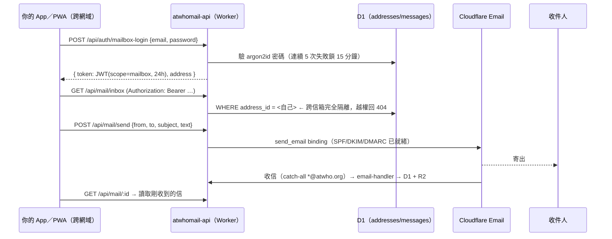

# 12. 外部 App／PWA 收發信整合指南

> **適用對象**：在**別的系統**自行開發、只想透過本系統「收信＋寄信」、**不需要任何管理功能**的 App／PWA。
> **認證模型**：Phase 11 Model C 的 **mailbox scope**（逐信箱隔離，SQL 層強制）。
> **最後驗證**：2026-10-06（所有端點皆以實際 HTTP 請求驗證過）。

## 1. 架構與認證流程



**mailbox token 的限制（即「不管理」的保證）**

| 可以 | 不可以 |
|---|---|
| 讀自己信箱（inbox/sent/archive/trash/spam） | 讀其他信箱（回 404，不洩漏存在性） |
| 寄信（`from` 必須是自己的地址） | 以其他地址寄信（403 `FROM_NOT_ALLOWED`） |
| 標記已讀／封存／搬資料夾／刪除自己的信 | 建立、刪除、列舉地址（403 `owner scope required`） |
| 改**自己**地址的密碼（需舊密碼） | 改其他地址、改 owner 密碼 |

## 2. App 要填的設定值

| 設定項 | 值 |
|---|---|
| API Base URL | `https://atwhomail-api.ulhome.workers.dev` |
| 認證 Header | `Authorization: Bearer <token>`（token 來自 mailbox-login） |
| Content-Type | `application/json`（**POST/PATCH 必須帶**，否則 preflight 失敗） |
| 信箱 | 例如 `app@atwho.org`（須為 `active` 且**已設密碼**才登得進去） |
| Token 有效期 | 24 小時，無 refresh token → 收到 401 就重新登入 |

## 3. 端點契約（皆已實測）

### 3.1 登入
```
POST /api/auth/mailbox-login
Body: { "email": "app@atwho.org", "password": "…" }
200 : { "token": "<JWT>", "session": "mailbox", "address": { "id": 12, "email": "app@atwho.org" } }
401 : { "error": { "code": "INVALID_CREDENTIALS", "message": "地址或密碼錯誤" } }
429 : { "error": { "code": "LOCKED", "message": "嘗試次數過多，請於 … 後再試" } }
```

### 3.2 信件列表
```
GET /api/mail/inbox?folder=inbox&limit=50&cursor=<nextCursor>
200 : { "items": [ { "id", "from", "subject", "text_preview",
                     "received_at", "read", "has_attachments", "folder" } ],
        "nextCursor": "1789…_14" | null }
```
- `folder` ∈ `inbox`（預設）／`sent`／`archive`／`trash`／`spam`；其他值 → 400 `INVALID_FOLDER`
- `limit` 1–100（預設 50）；`cursor` 直接用上一次回傳的 `nextCursor`（不要再自己解析）
- **注意**：`sent` 資料夾是「寄件備份」，要看寄出的信就查 `folder=sent`

### 3.3 讀取單封
```
GET /api/mail/:id
200 : { "id", "from", "to":[{"address","name"}], "cc":[…], "subject", "text_preview",
        "message_id", "received_at", "read_at", "folder", "html_url", "attachments":[…] }
404 : 不存在 **或** 不屬於此信箱（刻意的，不洩漏存在性）
```
- HTML 內文：`GET /api/mail/:id/html` → 200 `text/html`；**純文字信沒有 HTML → 404**（請以 `html_url` 是否為 `null` 判斷，別把 404 當錯誤）
- 附件清單：`GET /api/mail/:id/attachments` → `{ "message_id": 14, "attachments": [] }`
- 附件內容：`GET /api/attachments/:id`

### 3.4 寄信
```
POST /api/mail/send
Body: { "from": "app@atwho.org",
        "to": ["a@example.com"],            // 或 [{"address","name"}]
        "cc": [], "bcc": [],                 // 選填
        "subject": "主旨",
        "text": "純文字", "html": "<p>HTML</p>",   // 至少一個
        "attachments": [{ "filename":"f.pdf", "type":"application/pdf",
                          "content_base64":"…", "disposition":"attachment" }] }  // 選填
200 : { "messageId": "<…@atwho.org>", "send_status": "sent",
        "from": "app@atwho.org", "to": ["a@example.com"] }
```
- `from` **必須**是登入的地址且 `active`，否則 403 `FROM_NOT_ALLOWED`
- 內文＋附件合計 ≤ **5 MiB**（`PAYLOAD_TOO_LARGE`）；`to+cc+bcc` 合計 ≤ **50**
- 寄出後會在 D1 產生 `folder=sent` 備份（App 可在寄件備份看到）

### 3.5 狀態操作
```
PATCH /api/mail/:id/read      { "read": true }        標記已讀／未讀
PATCH /api/mail/:id/archive   —                        封存
PATCH /api/mail/:id/folder    { "folder": "trash" }    搬到指定資料夾
DELETE /api/mail/:id          —                        軟刪除
GET   /api/auth/whoami        —                        { "session":"mailbox", "scope":{…} }
```

## 4. 錯誤碼對照（App 端處理建議）

| HTTP | code | App 應該做什麼 |
|---|---|---|
| 401 | `UNAUTHORIZED` | token 無效／過期 → 重新登入 |
| 401 | `TOKEN_STALE` | 密碼已被變更 → 強制重新登入 |
| 403 | `FROM_NOT_ALLOWED` | 別讓使用者自填寄件者，固定用登入地址 |
| 403 | `owner scope required` | 呼叫到管理端點（本 App 不該用） |
| 404 | `NOT_FOUND` | 信件不存在或不屬於此信箱 |
| 413 | `PAYLOAD_TOO_LARGE` | 前端先擋（>5 MiB） |
| 422 | `WEAK_PASSWORD` | 新密碼至少 8 字元 |
| 429 | `LOCKED` | 顯示解鎖時間，勿自動重試 |
| 502 | `SEND_FAILED` | 上游寄信失敗 → 顯示可重試 |

## 5. CORS（跨網域瀏覽器呼叫的關鍵）

本 API **必須**允許你的來源，否則瀏覽器會在 preflight 就擋掉。2026-10-06 已實作：

- Worker 變數 `ALLOWED_ORIGINS`（`wrangler.jsonc` 的 `vars`），**逗號分隔**的來源白名單；`*` = 允許任何來源
- 命中白名單時回應 `Access-Control-Allow-Origin`／`Allow-Methods`／`Allow-Headers: Authorization, Content-Type, x-admin-token`／`Vary: Origin`，preflight (`OPTIONS`) 回 **204**
- 有白名單來源時 `Cross-Origin-Resource-Policy` 放行為 `cross-origin`；**無 Origin 的呼叫（伺服器端）維持 `same-origin`**，不影響既有安全設定
- 認證只用 Bearer token、**不用 cookie** → 不需要 `credentials: 'include'`

**收斂為正式白名單**（建議上線前做）：
```jsonc
// packages/api/wrangler.jsonc
"vars": {
  "ALLOWED_ORIGINS": "https://your-app.example.com,capacitor://localhost"
}
```
```bash
cd D:\Mail\Atwhomail\packages\api && pnpm exec wrangler deploy
```

**驗收**（PowerShell）：
```powershell
curl.exe -s -i -X OPTIONS -H "Origin: https://your-app.example.com" `
  -H "Access-Control-Request-Method: POST" `
  https://atwhomail-api.ulhome.workers.dev/api/mail/send | Select-String "HTTP/|Access-Control"
# 期待：HTTP/1.1 204 No Content + Access-Control-Allow-Origin: https://your-app.example.com
```

## 6. 前端最小範例（瀏覽器 / PWA）

```js
const API = "https://atwhomail-api.ulhome.workers.dev";
let token = sessionStorage.getItem("mailToken") ?? "";   // 避免 localStorage（XSS 風險較高）

async function login(email, password) {
  const r = await fetch(`${API}/api/auth/mailbox-login`, {
    method: "POST", headers: { "Content-Type": "application/json" },
    body: JSON.stringify({ email, password }),
  });
  if (!r.ok) throw new Error((await r.json()).error.message);
  token = (await r.json()).token;
  sessionStorage.setItem("mailToken", token);
}

const auth = () => ({ Authorization: `Bearer ${token}` });

async function listInbox(cursor) {
  const q = new URLSearchParams({ folder: "inbox", limit: "50", ...(cursor && { cursor }) });
  const r = await fetch(`${API}/api/mail/inbox?${q}`, { headers: auth() });
  if (r.status === 401) throw new Error("RELOGIN");     // 過期或密碼變更
  return r.json();                                       // { items, nextCursor }
}

async function sendMail({ to, subject, text, html }) {
  const r = await fetch(`${API}/api/mail/send`, {
    method: "POST",
    headers: { "Content-Type": "application/json", ...auth() },
    body: JSON.stringify({ from: "app@atwho.org", to: [to], subject, ...(text && { text }), ...(html && { html }) }),
  });
  return r.json();                                       // { messageId, send_status, … }
}
```

**後端代理的情況**：若 App 是透過自己的伺服器呼叫本 API（非瀏覽器直連），CORS 不影響；`ALLOWED_ORIGINS` 可留 `*` 或設為空。

## 7. 上線前檢查清單（給 App 團隊）

- [ ] 已建立 App 專用地址（`POST /api/email-addresses`，owner 權限）並**設定密碼**（`PATCH /api/email-addresses/:id/password`）
- [ ] 用該地址 `mailbox-login` 成功取得 token
- [ ] 以 token 讀 `inbox` 得 200；讀他人信件得 404；呼叫 `/api/email-addresses` 得 403
- [ ] `POST /api/mail/send` 成功且 `send_status = "sent"`；寄件備份出現在 `folder=sent`
- [ ] 由外部信箱寄信給該地址 → 出現在 `inbox`（收信鏈路）
- [ ] CORS：`ALLOWED_ORIGINS` 已收斂為 App 的正式網域並重新部署
- [ ] App 端處理 401（重新登入）與 429（鎖定）情境

## 8. 已知限制

| 限制 | 說明 |
|---|---|
| 附件總量 | 寄信 5 MiB；附件下載不支援 Range（無法續傳） |
| HTML 信件 | 遠端圖片會被剝離；`cid:` 內嵌圖不顯示（MVP 刻意） |
| 別名 | `email_aliases` 表已建但無 API |
| 配額 | Workers Paid（Email Sending 3,000 封/月）；D1/R2 免費額度內 |
| 監控 | `scripts/backup_watchdog.py` 每 10 分鐘檢查服務／備份／MTA-STS 訊號，異常寄信告警 |

## 9. 相關文件

- API 全貌（含 owner 端點）：`05-api-spec.md`
- 認證模型與安全：`08-security.md`
- 資源清單（帳號／zone／D1／R2／Worker）：`07-cloudflare-resources.md`
- 上線清單與已知缺口：`11-launch-checklist.md`
